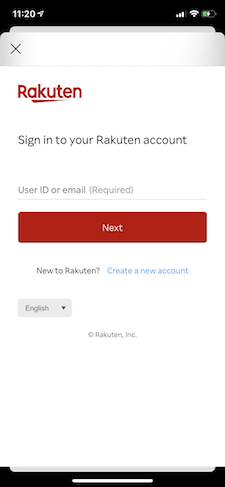
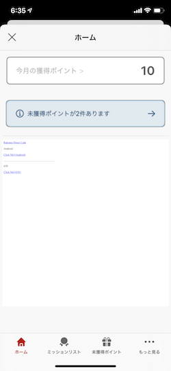
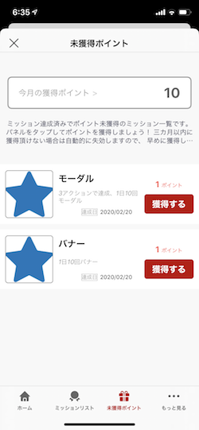

[TOP](../../README.md#top)　>　Basic Guide

---
# Initialize SDK
To use Reward SDK, need to establish SDK session first (to collect SDK user's basic information)

Call startSession method with parameters


```swift
RakutenReward.shared.startSession(appCode: "Your App Key", accessToken: <Access token>, completion: { r in
    if case .success(let user) =r {  // use portal or use additional setup
  }
}
```

| Parameter name        | Description           
| --- | --- 
| appCode | Application Key (This is from Rakuten Reward Developer Portal) 
| token | Access token to access Reward SDK API-C API |

## Initialization flow with Built-in Login service
1. Check if user has logged in to Reward SDK, 
2. if not open log in page
3. Start session after log in 

```swift
if RakutenReward.shared.isLogin() {
  RakutenReward.shared.startSession(appCode: <#appcode#>, completion:<#callback#>) 
} else {
  RakutenReward.shared.openLoginPage({_ in 
    // starting session ...
  }) 
}
```
---

# Log In

```swift
RakutenReward.shared.openLoginPage({result in 
    switch result:
    case .dismissByUser: // resume in another time
    case .LogInCompleted: // starting session
    case .failToShowLoginPage: // presenting problem
  }) 
```



# Log out

Logging user out: 

```swift
RakutenReward.shared.logout({ _ in
            }, forceRemoveToken: true)
RakutenReward.shared.logout({ result in
  switch result {
    case .success: // ending session
    case .failure: // ask user to log out again, display errors
  }
            })
```

# Getting user information

### Get user's full name

```swift
RakutenReward.shared.user?.getName()
```

### Get user Current point and rank: 

```swift
RakutenReward.shared.user?.currentPointRank()
```

---
# Mission Achievement 
To achieve mission, developers need to call post action API.  
After avhieving the mission, notification will be shown.  

## Post Action
```swift
RakutenReward.shared.logAction(actionCode: "<actionCode>", completionHandler: { actionResult in })
```
actionCode is provided by Reward SDK Developer Portal.  

## Notification UI
The user achieved the mission, notification UI is shown.  
Reward SDK provides Modal and Banner UI

     

### Notification Type
There  are 4 types of Mission Achievement UI. Modal, Banner, and No UI, and Custom which developed by developers.

You can decide type by Developer Portal 

| Notification Type        | UI
| --- | ---
| Modal | Show Modal UI provided by SDK
| Banner | Show Banner UI provided by SDK
| Custom | Developer can create UI by themselves
| No UI | Not show any UI

## SDK Portal
We provide User Portal UI for developers. To call Open SDK Portal API, developers can see user status (mission, unclaim list, current point, point history etc...)

This is UI Image







---
LANGUAGE :
> [](../ja/basic/README.md)
